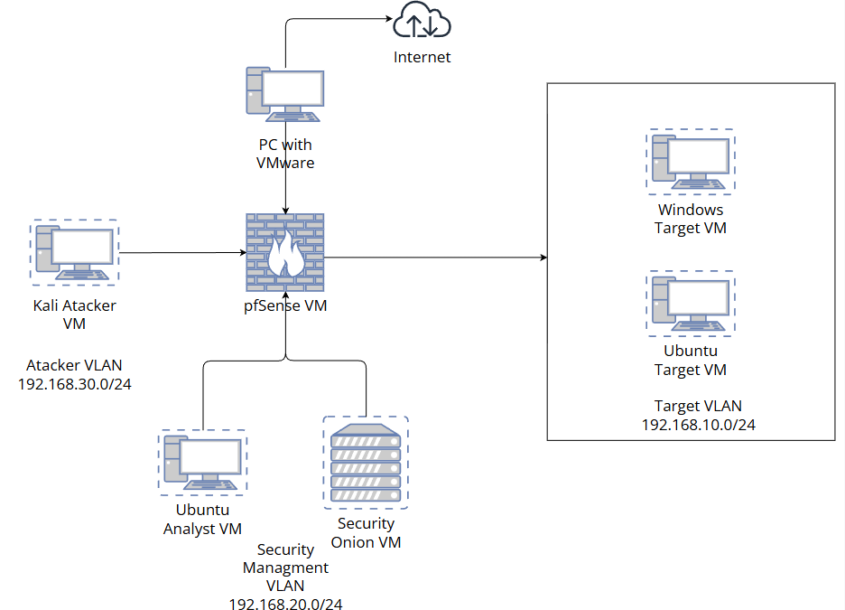
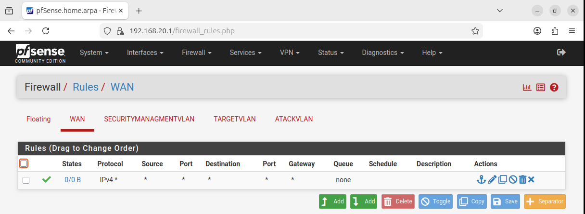
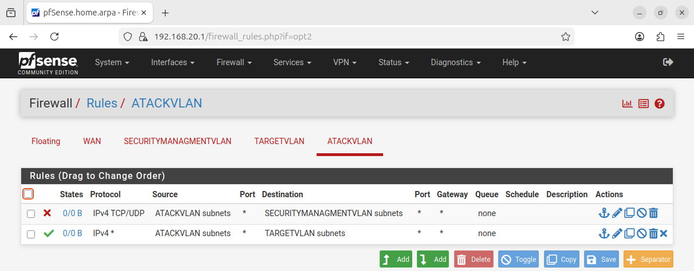
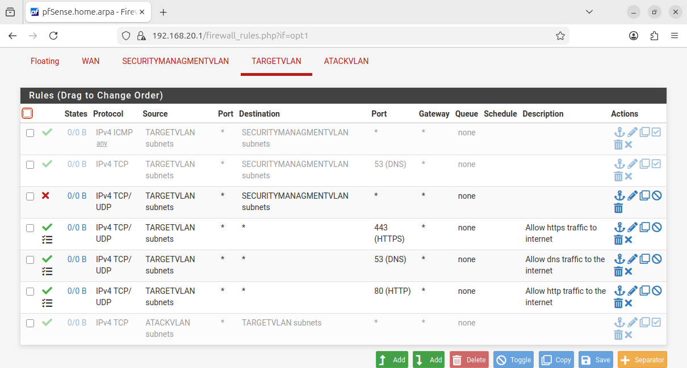
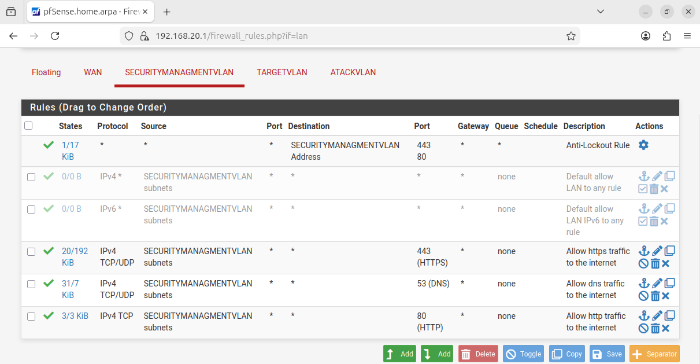

# Home Cybersecurity Lab — VMware + pfSense + Security Onion

> A fully isolated, segmented home lab environment built for practicing offensive security, network defense, and SIEM-based threat detection.

---

## Project Overview

This project is a virtualized cybersecurity lab deployed entirely in **VMware Workstation**. The goal was to simulate a realistic enterprise-like network environment with segmented VLANs, a stateful firewall, attacker and target machines, and a dedicated security monitoring stack.

The lab provides a safe, controlled space to:
- Practice penetration testing techniques
- Analyze network traffic and attacker behavior
- Explore SIEM capabilities with real attack data
- Understand firewall rule design and inter-VLAN routing

---

## Architecture



---

## Virtual Machines

| VM | OS | Role | Network |
|---|---|---|---|
| pfSense VM | pfSense CE | Firewall / Router | All VLANs |
| Kali Linux VM | Kali Linux | Attacker | ATTACKVLAN — 192.168.30.0/24 |
| Windows Target VM | Windows | Target | TARGETVLAN — 192.168.10.0/24 |
| Ubuntu Target VM | Ubuntu | Target | TARGETVLAN — 192.168.10.0/24 |
| Ubuntu Analyst VM | Ubuntu | Analyst Workstation | SECURITYMGMTVLAN — 192.168.20.0/24 |
| Security Onion VM | Security Onion | IDS / SIEM | SECURITYMGMTVLAN — 192.168.20.0/24 |

---

## VLAN Segmentation

The network is divided into three isolated VLANs, enforced by pfSense firewall rules:

| VLAN | Subnet | Purpose |
|---|---|---|
| ATTACKVLAN | 192.168.30.0/24 | Offensive operations (Kali Linux) |
| TARGETVLAN | 192.168.10.0/24 | Vulnerable target machines |
| SECURITYMGMTVLAN | 192.168.20.0/24 | Monitoring, analysis, SIEM |

---

## Firewall Rules

### WAN Interface



A single permissive IPv4 rule to allow the host machine outbound internet access through pfSense.

---

### ATTACKVLAN



The attacker VLAN is blocked from reaching the security management segment to prevent interference with monitoring tools. Traffic toward TARGETVLAN is permitted to allow attack scenarios.

---

### TARGETVLAN



Target machines are allowed limited communication with the security management segment (ICMP, DNS) for monitoring purposes, while general access to it is blocked. Outbound internet access is permitted on standard ports (80, 443, 53).

---

### SECURITYMGMTVLAN



The security management segment has broad outbound access to support tool updates, threat intelligence feeds, and analyst workflows. An anti-lockout rule ensures administrative access to pfSense is always maintained.

---

## Security Monitoring Stack

**Security Onion** was deployed as the primary detection and analysis platform, providing:

- **Suricata** — Network IDS/IPS with signature-based detection
- **Zeek (Bro)** — Deep network traffic analysis and logging
- **Elasticsearch** — Log ingestion, indexing, and storage
- **Kibana** — Dashboards and visualization of security events
- **SOC analyst workflows** — Alert triage, PCAP review, event correlation

Traffic from the TARGETVLAN was monitored by Security Onion, enabling real-time detection of attack patterns generated from the ATTACKVLAN.

---

## Skills Demonstrated

- **Network Design** — VLAN segmentation, subnetting, inter-VLAN routing
- **Firewall Administration** — Stateful rule creation and traffic policy enforcement in pfSense
- **Offensive Security** — Controlled attack scenarios from Kali Linux
- **Threat Detection** — IDS signature tuning, alert analysis in Security Onion
- **SIEM Operations** — Log analysis, dashboard creation, and event correlation in Elasticsearch/Kibana
- **Virtualization** — Multi-VM deployment and network configuration in VMware Workstation

---

## Technologies Used

`VMware Workstation` `pfSense CE` `Kali Linux` `Security Onion` `Suricata` `Zeek` `Elasticsearch` `Kibana` `Ubuntu` `Windows`

---

## Repository Structure

```
home-security-lab/
 ├── screenshots/
 │   ├── Schema.png
 │   ├── Attack.png
 │   ├── Target.png
 │   ├── Sec.png
 │   └── WAN_Interface.png
 ├── README.md
 └── README_RU.md
```

---

*Built for learning purposes. All attack activities were conducted exclusively within the isolated lab environment.*
